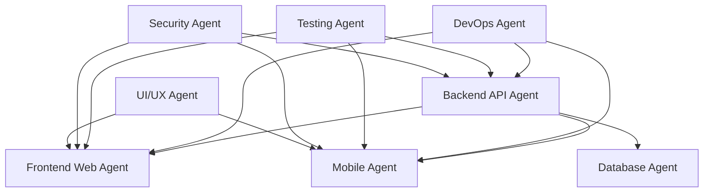

# CLAUDE.md - AI Agent Context & Development Standards

> **CRITICAL**: This document is the single source of truth for all AI agents and developers working on this project. Read and follow these guidelines meticulously.

## 🚨 CORE PRINCIPLE: NO OVER-ENGINEERING

**SIMPLICITY FIRST**: Choose the simplest solution that works. We prioritize:
1. **Working code** over perfect architecture
2. **Pragmatic solutions** over theoretical best practices  
3. **Quick iterations** over lengthy planning
4. **Proven patterns** over cutting-edge experiments

### The 3-Strike Rule
1. If it doesn't work on first try, simplify
2. If it breaks after deploy, revert and rethink
3. If it needs constant maintenance, replace with simpler solution

### What This Means Practically:
- **NO** complex abstractions until absolutely necessary
- **NO** premature optimization
- **NO** dependency hell - minimize external packages
- **YES** to boring, battle-tested technology
- **YES** to incremental improvements
- **YES** to "good enough" when it meets requirements

## 🎯 Project Overview

**Project**: Flying Nimbus Test
**Purpose**: Provider-agnostic application with Firebase as initial backend
**Architecture**: Modular, scalable, cloud-native with abstraction layers

## 🏗️ Architecture Principles

### Provider Agnosticism
- **NEVER** write Firebase-specific code directly in business logic
- **ALWAYS** use abstraction layers and interfaces
- **IMPLEMENT** repository pattern for data access
- **USE** dependency injection for service providers

```typescript
// ❌ BAD - Direct Firebase dependency
import { getFirestore } from 'firebase/firestore';
const db = getFirestore();

// ✅ GOOD - Abstracted interface
import { DatabaseProvider } from '@/providers/database';
const db = DatabaseProvider.getInstance();
```

### Service Layer Architecture
```
┌─────────────────┐
│   UI/Frontend   │
├─────────────────┤
│  GraphQL Layer  │ ← Provider-agnostic API
├─────────────────┤
│ Business Logic  │ ← Core domain logic
├─────────────────┤
│  Service Layer  │ ← Abstraction interfaces
├─────────────────┤
│   Providers     │ ← Firebase, AWS, Azure implementations
└─────────────────┘
```

## 📁 Project Structure

```
/
├── .claude/              # AI agent configuration
│   └── CLAUDE.md        # This file - source of truth
├── .github/             
│   ├── workflows/       # CI/CD pipelines
│   ├── CODEOWNERS      # Code ownership rules
│   └── pull_request_template.md
├── src/
│   ├── api/            # GraphQL schemas & resolvers
│   │   ├── schema/     # GraphQL type definitions
│   │   └── resolvers/  # GraphQL resolvers
│   ├── core/           # Business logic (provider-agnostic)
│   │   ├── entities/   # Domain entities
│   │   ├── usecases/   # Business use cases
│   │   └── interfaces/ # Contract definitions
│   ├── providers/      # External service implementations
│   │   ├── firebase/   # Firebase-specific code
│   │   ├── aws/        # AWS-specific code (future)
│   │   └── interfaces/ # Provider contracts
│   ├── services/       # Application services
│   ├── utils/          # Shared utilities
│   └── config/         # Configuration management
├── tests/
│   ├── unit/          # Unit tests
│   ├── integration/   # Integration tests
│   └── e2e/           # End-to-end tests
├── docs/
│   ├── API.md         # API documentation
│   ├── ARCHITECTURE.md # Architecture decisions
│   └── HANDOFF.md     # Context handoff procedures
└── scripts/           # Build and deployment scripts
```

## 🔒 Security Standards

### API Keys & Secrets
- **NEVER** commit secrets to the repository
- **USE** environment variables for all sensitive data
- **IMPLEMENT** secret rotation every 90 days
- **VALIDATE** all environment variables on startup

```typescript
// config/env.validation.ts
const requiredEnvVars = [
  'DATABASE_URL',
  'API_KEY',
  'JWT_SECRET'
];

requiredEnvVars.forEach(varName => {
  if (!process.env[varName]) {
    throw new Error(`Missing required environment variable: ${varName}`);
  }
});
```

### Input Validation
- **SANITIZE** all user inputs
- **VALIDATE** data at every layer
- **USE** schema validation (Zod, Joi, Yup)
- **IMPLEMENT** rate limiting on all endpoints

### Authentication & Authorization
- **USE** JWT tokens with short expiration (15 minutes)
- **IMPLEMENT** refresh token rotation
- **ENFORCE** least privilege principle
- **LOG** all authentication events

## 💰 Cost Optimization

### API Cost Management
```typescript
// Implement caching layer
class CacheService {
  private cache = new Map();
  private readonly TTL = 5 * 60 * 1000; // 5 minutes
  
  async get<T>(key: string, fetcher: () => Promise<T>): Promise<T> {
    const cached = this.cache.get(key);
    if (cached && cached.expiry > Date.now()) {
      return cached.data;
    }
    
    const data = await fetcher();
    this.cache.set(key, {
      data,
      expiry: Date.now() + this.TTL
    });
    return data;
  }
}
```

### Database Optimization
- **BATCH** operations when possible
- **PAGINATE** all list queries (max 100 items)
- **INDEX** frequently queried fields
- **MONITOR** query performance
- **IMPLEMENT** connection pooling

### Storage Optimization
- **COMPRESS** images before upload
- **USE** CDN for static assets
- **IMPLEMENT** lazy loading
- **SET** appropriate cache headers
- **CLEAN** orphaned files regularly

## 🚀 CI/CD Pipeline

### Git Workflow
- **BRANCH NAMING**: `feature/`, `bugfix/`, `hotfix/`, `release/`
- **COMMIT CONVENTION**: Use conventional commits
  ```
  feat: add user authentication
  fix: resolve memory leak in cache service
  docs: update API documentation
  refactor: extract validation logic
  test: add unit tests for user service
  chore: update dependencies
  ```

### Pipeline Stages
1. **Lint & Format** - ESLint, Prettier
2. **Type Check** - TypeScript strict mode
3. **Unit Tests** - Jest with 80% coverage minimum
4. **Integration Tests** - Test service interactions
5. **Security Scan** - Dependency vulnerabilities
6. **Build** - Production build
7. **Deploy Preview** - Deploy to staging
8. **E2E Tests** - Cypress/Playwright on staging
9. **Production Deploy** - After manual approval

### Quality Gates
- **Code Coverage**: Minimum 80%
- **Performance**: Lighthouse score > 90
- **Security**: No high/critical vulnerabilities
- **Type Safety**: Strict TypeScript, no `any`
- **Bundle Size**: Monitor and alert on > 10% increase

## 📝 Documentation Standards

### Code Documentation
```typescript
/**
 * Processes user registration with email verification
 * 
 * @param {RegisterUserDto} userData - User registration data
 * @returns {Promise<User>} Created user object
 * @throws {ValidationError} If input data is invalid
 * @throws {ConflictError} If email already exists
 * 
 * @example
 * const user = await registerUser({
 *   email: 'user@example.com',
 *   password: 'SecurePass123!'
 * });
 */
async function registerUser(userData: RegisterUserDto): Promise<User> {
  // Implementation
}
```

### API Documentation
- **USE** GraphQL schema as documentation
- **PROVIDE** example queries and mutations
- **DOCUMENT** error codes and responses
- **MAINTAIN** Postman/Insomnia collections

### Context Handoff Rules
When handing off context to another AI agent or developer:

1. **Current State Summary**
   - What was just completed
   - What is currently in progress
   - What needs to be done next

2. **Technical Context**
   - Active feature branches
   - Pending migrations
   - Environment-specific configurations
   - Known issues or blockers

3. **Business Context**
   - User stories being addressed
   - Priority levels
   - Deadlines or time constraints

4. **Testing Status**
   - Tests written
   - Tests passing/failing
   - Coverage metrics

## 🧪 Testing Standards

### Test Categories
- **Unit Tests**: Test individual functions/methods
- **Integration Tests**: Test service interactions
- **E2E Tests**: Test user workflows
- **Performance Tests**: Load and stress testing

### Test Naming Convention
```typescript
describe('UserService', () => {
  describe('registerUser', () => {
    it('should create a new user with valid data', async () => {});
    it('should throw ValidationError for invalid email', async () => {});
    it('should throw ConflictError for duplicate email', async () => {});
  });
});
```

### Test Data Management
- **USE** factories for test data generation
- **ISOLATE** test databases
- **CLEAN** test data after each test
- **MOCK** external services

## 🔄 Continuous Improvement

### Code Review Checklist
- [ ] Follows architecture principles
- [ ] Includes appropriate tests
- [ ] Documentation is updated
- [ ] No hardcoded values
- [ ] Error handling is comprehensive
- [ ] Performance impact considered
- [ ] Security implications reviewed
- [ ] Backward compatibility maintained

### Performance Monitoring
- **TRACK** API response times
- **MONITOR** error rates
- **ALERT** on anomalies
- **REVIEW** metrics weekly

### Technical Debt Management
- **DOCUMENT** technical debt in issues
- **ALLOCATE** 20% of sprint for debt reduction
- **PRIORITIZE** security and performance debt
- **REVIEW** debt quarterly

## 🚨 Emergency Procedures

### Incident Response
1. **Identify** severity (P1-P4)
2. **Notify** stakeholders
3. **Mitigate** immediate impact
4. **Investigate** root cause
5. **Fix** and deploy
6. **Document** post-mortem

### Rollback Procedure
```bash
# Quick rollback to previous version
npm run deploy:rollback

# Or manual rollback
git revert HEAD
git push origin main
npm run deploy:production
```

## 🤖 AI Agent Ecosystem

### Specialized Sub-Agents for Seamless Development

#### 1. **Backend API Agent** 🔧
**Responsibility**: Server-side logic, database operations, API endpoints
- GraphQL schema design and resolvers
- Provider-agnostic service implementations
- Authentication and authorization
- Data validation and sanitization
- Performance optimization and caching

```typescript
// Handoff Context Required:
interface BackendContext {
  currentEndpoints: string[];
  databaseSchema: Record<string, any>;
  authStrategy: 'jwt' | 'oauth' | 'custom';
  performanceMetrics: any;
}
```

#### 2. **Frontend Web Agent** 💻
**Responsibility**: React/Vue/Svelte web application
- Component architecture and state management
- Responsive design and accessibility
- API integration and error handling  
- Performance optimization (lazy loading, code splitting)
- PWA features and offline support

```typescript
// Handoff Context Required:
interface WebContext {
  componentLibrary: 'react' | 'vue' | 'svelte';
  stateManagement: 'redux' | 'zustand' | 'pinia';
  routingStrategy: any;
  apiEndpoints: string[];
  designSystem: any;
}
```

#### 3. **Mobile Agent** 📱
**Responsibility**: React Native or cross-platform mobile app
- Native feature integration (camera, GPS, push notifications)
- Platform-specific optimizations (iOS/Android)
- App store deployment and versioning
- Offline-first architecture
- Performance profiling and optimization

```typescript
// Handoff Context Required:  
interface MobileContext {
  platform: 'react-native' | 'flutter' | 'native';
  targetPlatforms: ('ios' | 'android')[];
  nativeFeatures: string[];
  appStoreStatus: any;
  performanceMetrics: any;
}
```

#### 4. **Database Agent** 🗄️
**Responsibility**: Data architecture and migrations
- Schema design and relationships
- Migration scripts and versioning
- Query optimization and indexing
- Data seeding and fixtures
- Backup and disaster recovery

```typescript
// Handoff Context Required:
interface DatabaseContext {
  currentSchema: any;
  pendingMigrations: string[];
  queryPerformance: any;
  backupStrategy: string;
  provider: 'firebase' | 'postgres' | 'mongodb';
}
```

#### 5. **DevOps Agent** ⚙️
**Responsibility**: Infrastructure, deployment, monitoring
- CI/CD pipeline maintenance
- Environment management (staging, production)
- Monitoring and alerting setup
- Security scanning and compliance
- Performance monitoring and scaling

```typescript
// Handoff Context Required:
interface DevOpsContext {
  deploymentStatus: any;
  environmentHealth: Record<string, 'healthy' | 'degraded' | 'down'>;
  monitoringAlerts: any[];
  securityScans: any;
  infrastructureState: any;
}
```

#### 6. **Testing Agent** 🧪
**Responsibility**: Comprehensive testing strategy
- Unit test coverage and maintenance
- Integration test scenarios
- E2E test automation
- Performance and load testing
- Test data management and mocking

```typescript
// Handoff Context Required:
interface TestingContext {
  coverageMetrics: any;
  failingTests: string[];
  testDataStrategy: string;
  e2eScenarios: any[];
  performanceBaselines: any;
}
```

#### 7. **Security Agent** 🔒
**Responsibility**: Security implementation and auditing
- Authentication and authorization flows
- Input validation and sanitization
- Security header configuration
- Vulnerability scanning and remediation
- Compliance and audit preparation

```typescript
// Handoff Context Required:
interface SecurityContext {
  authFlows: any[];
  vulnerabilities: any[];
  complianceStatus: any;
  securityHeaders: Record<string, string>;
  auditFindings: any[];
}
```

#### 8. **UI/UX Agent** 🎨
**Responsibility**: Design system and user experience
- Component library maintenance
- Design system consistency
- Accessibility compliance (WCAG)
- User flow optimization
- Performance impact of UI changes

```typescript
// Handoff Context Required:
interface UIContext {
  designSystem: any;
  componentLibrary: any;
  accessibilityAudit: any;
  userFlows: any[];
  performanceImpact: any;
}
```

### Agent Communication Protocol

#### Handoff Checklist
```markdown
## Agent Handoff Template

### Context Summary
- [ ] Current task status
- [ ] Blockers or dependencies  
- [ ] Recent changes made
- [ ] Next priority items

### Technical State
- [ ] Branch information
- [ ] Build/test status
- [ ] Environment state
- [ ] Configuration changes

### Business Context
- [ ] User stories affected
- [ ] Performance impact
- [ ] Timeline considerations
- [ ] Stakeholder communications needed

### Agent-Specific Context
- [ ] Specialized context object provided
- [ ] Integration points documented
- [ ] Error states handled
- [ ] Monitoring/logging updated
```

#### Inter-Agent Dependencies


### Orchestrator-Worker Pattern (Inspired by Anthropic's Multi-Agent Research)

#### Lead Agent Responsibilities
The first agent in any session acts as the **Orchestrator** and must:
1. **Analyze** the overall task complexity
2. **Decompose** into specific subtasks for specialized agents
3. **Delegate** with clear objectives and boundaries
4. **Coordinate** parallel work streams
5. **Synthesize** results from subagents
6. **Validate** end-state achievements

#### Task Decomposition Strategy
```typescript
interface TaskDecomposition {
  taskId: string;
  complexity: 'simple' | 'moderate' | 'complex';
  requiresMultipleAgents: boolean;
  parallelizable: boolean;
  subtasks: {
    agentType: string;
    objective: string;
    dependencies: string[];
    successCriteria: string;
  }[];
}
```

#### Adaptive Coordination Strategies
1. **Broad to Narrow**: Start with general objectives, progressively focus
2. **Parallel Exploration**: Multiple agents work simultaneously when possible  
3. **Dynamic Adjustment**: Agents can modify approach based on findings
4. **Progressive Refinement**: Iterate on solutions rather than one-shot attempts

#### Agent Activation Rules (Enhanced)
**Single Agent Tasks** (no coordination needed):
- Simple bug fixes within one domain
- Documentation updates
- Code formatting/linting
- Basic configuration changes

**Multi-Agent Tasks** (requires orchestration):
- Feature development spanning multiple layers
- Performance optimization across system
- Security audits affecting multiple components
- Complex debugging involving multiple systems

#### When to Call Specific Agents:
- **Backend API**: Database changes, new endpoints, performance issues
- **Frontend Web**: UI changes, state management, web-specific features
- **Mobile**: Native features, app store issues, mobile-specific bugs
- **Database**: Schema changes, migrations, query optimization
- **DevOps**: Deployment issues, environment setup, monitoring
- **Testing**: Coverage drops, test failures, new test scenarios  
- **Security**: Auth changes, vulnerability reports, compliance needs
- **UI/UX**: Design updates, accessibility issues, user experience

#### Orchestration Examples
```typescript
// Example: User Authentication Feature
const authFeatureTask: TaskDecomposition = {
  taskId: 'user-auth-implementation',
  complexity: 'complex',
  requiresMultipleAgents: true,
  parallelizable: true,
  subtasks: [
    {
      agentType: 'database',
      objective: 'Design user schema with auth fields',
      dependencies: [],
      successCriteria: 'User table with secure password storage'
    },
    {
      agentType: 'backend-api', 
      objective: 'Implement JWT auth endpoints',
      dependencies: ['database'],
      successCriteria: 'Working login/register/refresh endpoints'
    },
    {
      agentType: 'security',
      objective: 'Review auth implementation for vulnerabilities',
      dependencies: ['backend-api'],
      successCriteria: 'Security audit passed with no critical issues'
    },
    {
      agentType: 'frontend-web',
      objective: 'Create login/register UI components',
      dependencies: ['backend-api'],
      successCriteria: 'Functional auth forms with error handling'
    }
  ]
};
```

#### Intelligent Coordination
- **Extended Thinking**: Make reasoning visible in handoffs
- **Context Compression**: Summarize findings for next agents
- **Failure Recovery**: Automatic fallback to simpler approaches
- **Success Validation**: End-state evaluation, not process adherence

#### Conflict Resolution (Enhanced):
1. **Orchestrator** makes final architectural decisions
2. **Security Agent** can veto any security risk
3. **Database Agent** owns schema integrity  
4. **DevOps Agent** controls infrastructure constraints
5. **Domain Expert** wins within their boundary
6. **Business Requirements** override technical preferences

### For New AI Agents
1. **READ** this entire document before making any changes
2. **IDENTIFY** which specialized agent you are (or general-purpose)
3. **CHECK** current branch and status: `git status`
4. **REVIEW** recent commits: `git log --oneline -10`
5. **REQUEST** handoff context from previous agent if needed
6. **TEST** locally before committing
7. **DOCUMENT** your changes thoroughly
8. **PROVIDE** handoff context for next agent

### Communication Protocol
- **START** each session by reviewing this document
- **ANNOUNCE** what you plan to change and which agent type you are
- **REQUEST** context from relevant specialized agents
- **EXPLAIN** architectural decisions
- **WARN** about breaking changes
- **SUMMARIZE** what was accomplished
- **PROVIDE** handoff context for next agent

### Code Generation Rules
- **PREFER** TypeScript over JavaScript
- **USE** functional programming where appropriate
- **AVOID** premature optimization
- **IMPLEMENT** error boundaries
- **ADD** loading and error states
- **INCLUDE** accessibility features
- **FOLLOW** your specialized agent responsibilities

## 📊 Metrics & KPIs

### Development Metrics
- **Deployment Frequency**: Daily
- **Lead Time**: < 2 hours
- **MTTR**: < 30 minutes
- **Change Failure Rate**: < 5%

### Application Metrics
- **Uptime**: 99.9%
- **Response Time**: P95 < 200ms
- **Error Rate**: < 0.1%
- **User Satisfaction**: > 4.5/5

## 🔄 Update Log

### Version Control for This Document
- **Last Updated**: 2025-08-07
- **Version**: 1.0.0
- **Changed By**: Initial setup by AI Agent

---

## ⚡ Quick Commands

```bash
# Development
npm run dev              # Start development server
npm run test            # Run all tests
npm run test:watch      # Run tests in watch mode
npm run lint            # Lint code
npm run format          # Format code

# Deployment
npm run build           # Build for production
npm run deploy:staging  # Deploy to staging
npm run deploy:prod     # Deploy to production

# Utilities
npm run analyze         # Analyze bundle size
npm run security        # Security audit
npm run update:deps     # Update dependencies safely
```

## 🎯 Current Priorities

1. **Establish provider-agnostic architecture**
2. **Set up comprehensive testing**
3. **Implement CI/CD pipeline**
4. **Create GraphQL API layer**
5. **Document all decisions**

---

**Remember**: This document is living and should be updated as the project evolves. All architectural decisions should be documented here first before implementation.